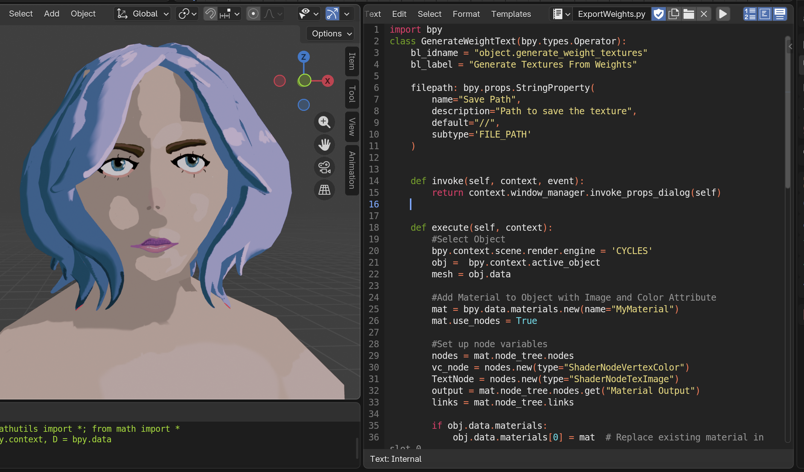

Hi, this is just a short little script to help you export your Blender Weight Paint data as a series of png files.

*STEPS TO RUN*
1. Download the script and open it in Blender's TextEditor
2. Select the Object that contains the weight paint data you'd like to export
3. press run in the TextEditor
4. Set a Directory

   

